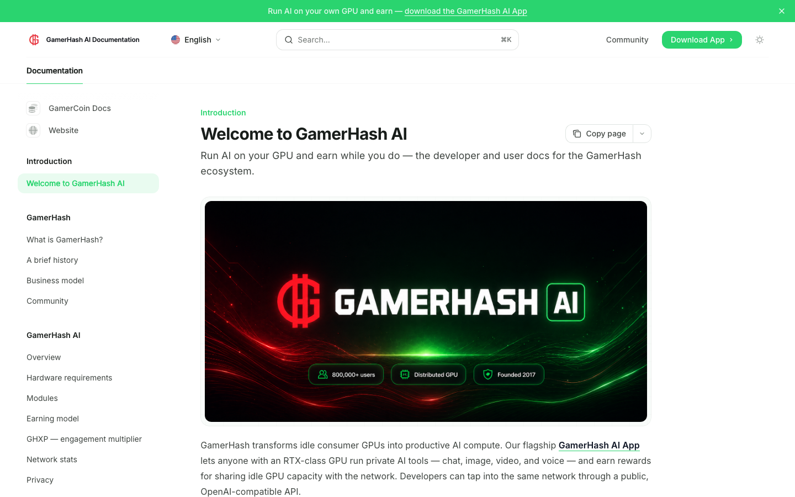

# GamerHash Documentation

Source for the official GamerHash documentation site — the AI App, the deAPI, the ecosystem, and the GHXP / earning model.



Built with [Mintlify](https://mintlify.com). Multilingual: English (root), Polish (`pl/`), Korean (`ko/`).

## What's in here

| Section | What it covers |
| --- | --- |
| `ecosystem/` | What GamerHash is, history, business model, community |
| `ai/` | AI App — overview, modules, hardware requirements, earning, GHXP, privacy, network stats |
| `apps/` | Mobile and store apps |
| `deapi/` | Public developer API for the GamerHash GPU network |
| `tutorials/` | Install AI App, earn with GPU |
| `use-cases/` | Gamers, GPU contributors, AI builders |
| `legal/` | Terms, disclaimers, AML/CFT |
| `roadmap.mdx` | Quarterly delivery log |

Companion repo: [gamercoin-docs](https://github.com/rektor-jg/gamercoin-docs) — GHX token documentation.

## Local development

Install the Mintlify CLI and run the dev server from the repo root:

```bash
npm i -g mint
mint dev
```

The site will be served at `http://localhost:3000`.

## Structure

```
.
├── docs.json            # Mintlify config — navigation, theme, languages
├── index.mdx            # English landing page
├── pl/                  # Polish mirror — every EN page has a PL counterpart
├── ko/                  # Korean mirror — every EN page has a KO counterpart
├── ai/                  # See table above
├── apps/
├── deapi/
├── ecosystem/
├── legal/
├── tutorials/
├── use-cases/
├── images/              # Diagrams, hero art, screenshots (PNG/SVG)
├── logo/                # Brand logos
└── snippets/            # Reusable MDX components (chain badges, etc.)
```

## Contributing

- Every content change in EN must land in `pl/` and `ko/` in the same PR — keep facts identical, translate naturally.
- Image alt text should be translated, not copied from EN.
- New navigation entries belong in `docs.json` under each language block.
- Cross-links between this repo and `gamercoin-docs` should point at the live docs URLs, not file paths.

## License

Content © GamerHash. See `legal/` for terms.
